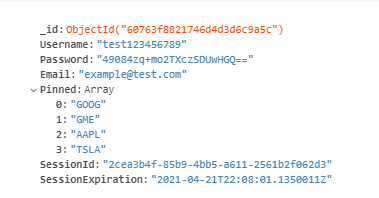

# KUMetriX

A stock data web app built using the [Safe Stack](https://safe-stack.github.io/) with the [Feliz SAFE Template](https://github.com/Zaid-Ajaj/SAFE.Simplified) that features:

<ul>
<li>Basic Authentication / Profile Storage (Azure hosted MongoDB)</li>
<li>Login Sessions implemented with GUID Session ID's and DateTime Expiration</li>
<li>Argon2id Password Hashing (<a href="https://cheatsheetseries.owasp.org/cheatsheets/Password_Storage_Cheat_Sheet.html">OWASP Standard</a>)</li>
<li> <a href="https://elmish.github.io/elmish/">Elmish</a> MVU Single Page Application (built on top of React)</li>
<li>Supports Time Travel Debugging (<a href="https://chrome.google.com/webstore/detail/redux-devtools/lmhkpmbekcpmknklioeibfkpmmfibljd?hl=en">Redux DevTools</a>)</li>
<li>Persistent State with Local Storage </li>
<li>Secrets/Environment variables using config.json</li>
</ul>
 

## MongoDB Profile Structure:

  

## Video Demo:

https://user-images.githubusercontent.com/24596353/115722179-bab1f980-a34c-11eb-83bf-abf169b13216.mp4

  

## Set up:

- Download / Clone Repo
- Set up [Azure CosmosDB](https://azure.microsoft.com/en-us/services/cosmos-db/) (choose MongoDB)
- Set up [MarketStack Account](https://marketstack.com/) and create API Key
- Install Software Dependencies
- Add config.json to server directory
- Start Server & Client
    

### Software Dependencies

- [.NET Core SDK 3.1+](https://dotnet.microsoft.com/download)
- [Node.js 12.0+](https://nodejs.org/en)
    

### Config:

Add config.json to server directory

<pre><code>{
  "DBCONNECTIONSTRING": "MongoDB connection string",
  "INACTIVESESSIONID": "00000000-0000-0000-0000-000000000000",
  "INACTIVESESSIONEXPIRATION": "0001-01-01T00:00:00.0000000",
  "DBNAME": "MongoDB Name",
  "COLLECTIONNAME": "MongoDB Collection Name",
  "PREFIXSALT": "Salt String",
  "SUFFIXSALT": "Salt String",
  "EXTERNALSTOCKAPIKEY": "Market Stack API key",
  "STOCKAPIBASEURL": "http://api.marketstack.com/v1/eod",
  "CSUSIGNUPCODE": "Sign Up String",
  "PROGSIGNUPCODE": "Sign Up String",
  "GENERICSIGNUPCODE": "Sign Up String"
}
</code></pre>
 

### Server:

fetch server packages and run

<pre><code>cd server
dotnet restore
dotnet run
</code></pre>

Served from: http://localhost:5000
  

### Client:

fetch client packages and run

<pre><code>cd client
npm install
npm start
</code></pre>

Served from: http://localhost:8080 (Webpack forwards requests to server port)
  

### Deployment:

Run Prod build and output is sent to {solutionRoot}/dist
Deploy with [Azure Web Apps](https://azure.microsoft.com/en-us/services/app-service/web/)

<pre><code>dotnet run
 _______    _       ___  ____   ________
|_  __  |  / \     |_  ||_  _| |_   __  |
 | |_ \_| / _ \      | |_/ /     | |_ \_|
 |  _|   / ___ \     |  __'.     |  _| _
_| |_  _/ /   \ \_  _| |  \ \_  _| |__/ |
|____||____| |____||____||____||________| 

[Interactive Mode] Run build target: Pack
run Pack
</code></pre>

More info at [Template Repo](https://github.com/Zaid-Ajaj/SAFE.Simplified)
  

## References:

#### Overall Tech stack 
<ul>
<li>https://safe-stack.github.io/</li>
</ul>

#### Database/Data Access layer
<ul>
<li>https://docs.mongodb.com/</li>
<li>https://medium.com/@mukund.sharma92/cruding-in-f-with-mongodb-e4699d1ac17e 
</li>
<li>https://github.com/mongodb/mongo-csharp-driver</li>
<li>https://github.com/tkellogg/MongoDB.FSharp </li>
</ul>

#### External Stock API
<ul>
<li>https://marketstack.com/documentation</li>
</ul>

#### Logo Creator
<ul>
<li>https://www.canva.com/create/logos/</li>
</ul>

#### Server
<ul>
<li>https://saturnframework.org/explanations/overview.html</li>
</ul>

#### Client
<ul>
<li>https://github.com/Zaid-Ajaj/Feliz</li>
<li>https://zaid-ajaj.github.io/Feliz/ </li>
<li>https://zaid-ajaj.github.io/the-elmish-book/#/</li>
</ul>

#### Validators
<ul>
<li>https://www.softwarepark.cc/blog/2019/12/8/functional-validation-in-f-using-applicatives</li>
</ul>

#### App/Build Template
<ul>
<li>https://github.com/Zaid-Ajaj/SAFE.Simplified</li>
</ul>

#### Home Svg Animation
<ul>
<li>https://loading.io/background/m-valley/</li>
</ul>

#### Icon Library
<ul>
<li>https://fontawesome.com/icons?m=free</li>
</ul>

#### CSS Library
<ul>
<li>https://bulma.io/</li>
</ul>